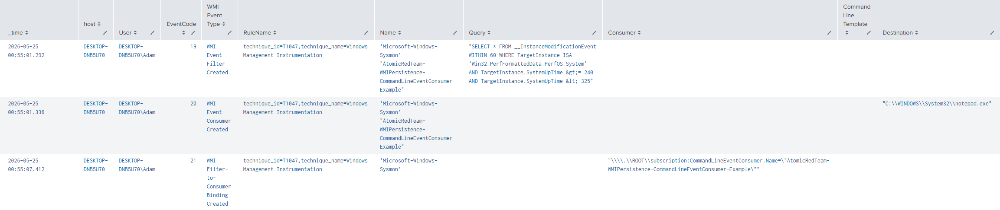

# H002 - WMI Event Subscription Persistence

## Hypothesis

An attacker may create a permanent WMI event subscription to maintain persistence on a Windows endpoint.

This technique can involve creating three WMI components:

- An event filter, which defines the trigger condition
- An event consumer, which defines the action to execute
- A filter-to-consumer binding, which links the trigger to the action


## MITRE ATT&CK Mapping

| Technique ID | Technique |
| T1546.003 | Event Triggered Execution: Windows Management Instrumentation Event Subscription |

This hunt maps to MITRE ATT&CK `T1546.003` because WMI event subscriptions can be used to execute commands automatically when a defined WMI event condition is met.

- https://attack.mitre.org/techniques/T1546/003/


## Test Method

## T1546.003-1: Persistence via WMI Event Subscription - CommandLineEventConsumer

This test uses Atomic Red Team technique **T1546.003** to simulate persistence through a **WMI Event Subscription** using a `CommandLineEventConsumer`. 

I Ran the test with the below (Required installing atomic red prereq):

```powershell
Invoke-AtomicTest T1546.003 -TestNumbers 1 -PathToAtomicsFolder C:\AtomicRedTeam\atomics
```


## Hunting for WMI Persistence with Sysmon

```spl
index=sysmon earliest=-30m (EventCode=19 OR EventCode=20 OR EventCode=21)
| eval wmi_event_type=case(
    EventCode=19, "WMI Event Filter Created",
    EventCode=20, "WMI Event Consumer Created",
    EventCode=21, "WMI Filter-to-Consumer Binding Created",
    true(), "Other WMI Event"
)
| table _time host User EventCode wmi_event_type RuleName Name Query Consumer CommandLineTemplate Destination
| rename wmi_event_type as "WMI Event Type", CommandLineTemplate as "Command Line Template"
| sort _time
```

**Results**



