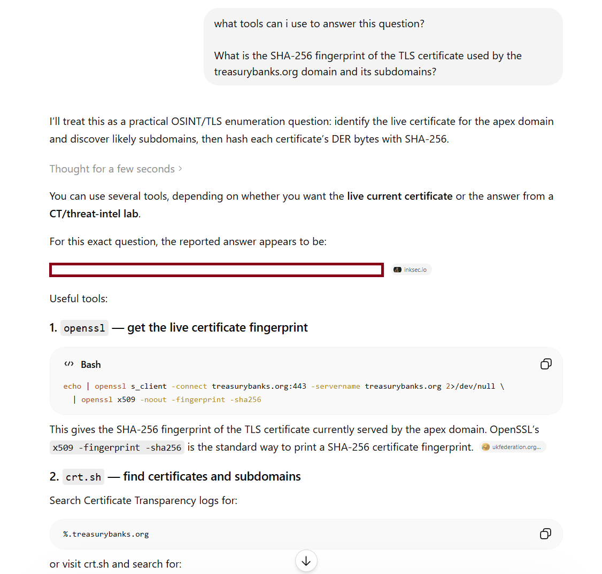
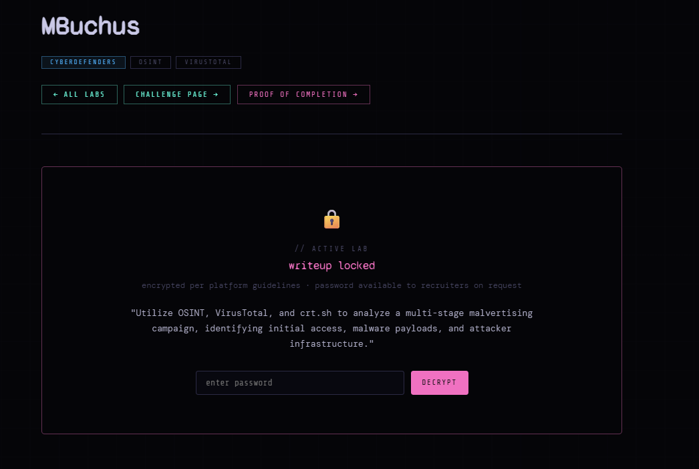
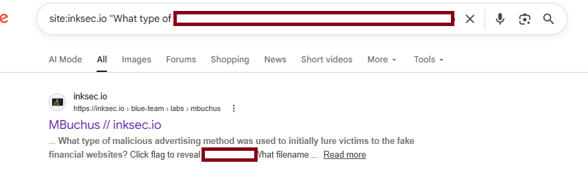
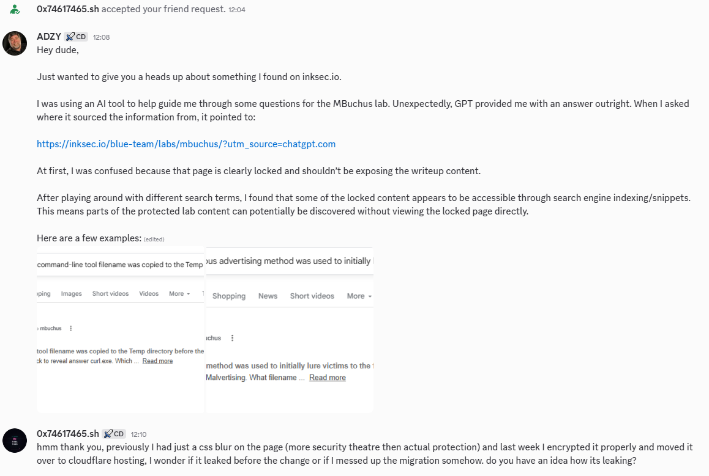
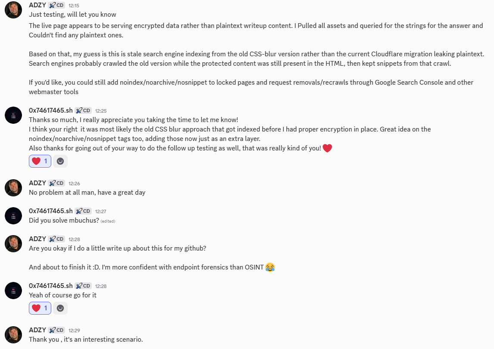
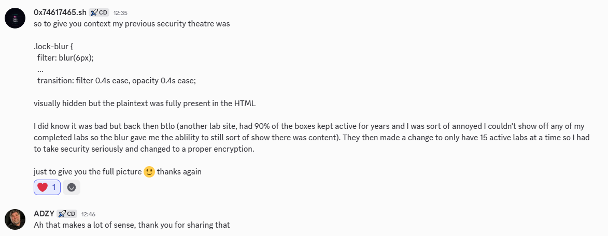

# Indexed Content Disclosure via Search Engine Snippets

## Summary

While working through an active CyberDefenders lab, I noticed that GPT was able to provide an answer that should not have been publicly visible. Active CyberDefenders labs do not provide official writeups and are intended to be completed without public answers or hints.

After investigating the source, I found that search engine snippets were exposing parts of a locked third party writeup page. Further testing suggested this was likely stale indexed content from an older version of the site, where the writeup had been visually hidden using a CSS blur while the plaintext content still existed in the page HTML.

I contacted the site owner, who confirmed the site had recently been migrated and that the protection mechanism had changed. Testing of the current deployment found no plaintext matches in the live page or common generated assets, suggesting the current version was no longer actively leaking the content and that the exposed snippets were likely remnants from earlier search engine indexing.

## What Happened

The issue was discovered while using GPT to help with a lab question. The tool provided an answer directly, which raised the question: where did it get that answer from?

### GPT Prompt 



-  When navigating to the URL, we can observe a lock screen. GPT provided the answer directly and it was correct..., However, was not very useful in terms of explaining how it potentially bypassed a lock screen :D, but it at least provided the source, being a inksec.io url. 



- Searching for exact question text using search operators showed that search engine snippets were exposing parts of the locked content from inksec.io. Inksec is a cybersecurity portfolio and blue team writeup site that publishes lab investigations, SOC-style case studies, and security learning content.

Example search pattern:

```text
site:inksec.io "exact question text from the locked content"
```

- This showed that the content had likely been indexed previously, even though the page was now locked and more secure. 



- This search exposed the answer to a question which should be behind a locked screen.


## Root Cause

The likely root cause was the previous use of client side visual hiding.

In the older implementation, the content was hidden using a CSS blur. While this prevents a casual viewer from reading the content in the browser, it does not prevent crawlers, search engines, or other tools from reading the HTML.

If protected content is sent to the browser in plaintext, it should be considered exposed.

## Validation and Testing Commands

To determine whether the current deployment was still leaking plaintext, I downloaded and searched the live page and common generated file assests. 

Checked items included:

* Live page HTML
* `sitemap.xml`
* `robots.txt`
* RSS/feed files
* `search.json`
* `index.json`
* Pagefind files
* Source maps

### Download the live locked page

```spl
curl.exe -L "https://inksec.io/blue-team/labs/mbuchus/" -o mbuchus.html
```

### Download common static/generated assets

```spl
$urls = @(
  "https://inksec.io/sitemap.xml",
  "https://inksec.io/robots.txt",
  "https://inksec.io/rss.xml",
  "https://inksec.io/feed.xml",
  "https://inksec.io/search.json",
  "https://inksec.io/index.json",
  "https://inksec.io/pagefind/pagefind-entry.json",
  "https://inksec.io/LabLayout.astro_astro_type_script_index_0_lang.DuHEJc-H.js.map"
)

foreach ($url in $urls) {
  $name = ($url -replace "https://inksec.io/","" -replace "/","_")
  Write-Host "Downloading $url -> $name"
  curl.exe -L $url -o $name
}
```

### Search all downloaded files for plaintext indicators
```spl
Select-String -Path .\* -Pattern `
  "treasurybanks",`
  "329ec925",`
  "SHA-256",`
  "Temp directory",`
  "What legitimate command-line tool",`
  "What is the SHA-256 fingerprint",`
  "What type of malicious advertising method was used to initially lure victims to the fake financial websites?" `
  -CaseSensitive:$false
```

- Search terms included known leaked indicators and exact question fragments. (Certain searches redacted for integrity)

- No plaintext matches were found in the current deployment during testing.

- This suggests the current site was likely not actively leaking plaintext, and the visible snippets were stale search engine indexing from the earlier CSS-blur version.
  

## Communication with the Site Owner

I contacted the site owner and shared the finding. 

The owner responded positively and explained that the site had recently been migrated. They also confirmed that the earlier version used a CSS blur as a lightweight visual barrier, while the newer version had moved to encrypted content.

This helped narrow the likely cause to stale indexing from the older implementation rather than an active issue in the current deployment.








## Impact

Search engine snippets can continue to expose content even after a page has been updated or locked down.


The impact was broader than a single exposed answer or one locked page.

Because the previous protection relied on client-side visual hiding, any gated writeup published while that mechanism was active may have been served to visitors and crawlers with the full plaintext content still present in the page HTML. This means the effective exposure surface was not just the lab page that triggered this investigation, but potentially the wider catalogue of gated writeups from that period.

Although the current deployment did not appear to expose plaintext during testing, search engine snippets showed that previously indexed content could continue to surface after the site had been migrated and the original issue had been fixed. This creates a delayed-impact problem: protected content may remain discoverable through search engines, cached snippets, or AI tools that use indexed web context, even when the live page no longer leaks the same data.

- Protected lab writeups being partially exposed through search snippets
- Challenge answers or investigation details becoming discoverable without access to the locked page
- AI tools surfacing stale indexed answers during user prompts
- Previously exposed content persisting after the live site has been fixed
- Loss of intended challenge integrity for active or gated labs
- Increased difficulty fully remediating the issue, since search engines and third-party indexes may retain stale fragments


## Lessons Learned

Client-side hiding is not access control.

CSS blur, hidden divs, disabled copy/paste, or JavaScript-only locks should not be used to protect sensitive content.

If unauthorised users or crawlers receive the plaintext content, the content is exposed.

## Recommendations

To prevent this type of issue:

* Do not send protected plaintext content to unauthorised users
* Enforce access control server-side where possible
* Exclude protected content from static search indexes
* Check generated files such as sitemaps, feeds, JSON indexes, and source maps
* Add `noindex`, `noarchive`, and `nosnippet` to protected pages where appropriate
* Request removals or recrawls through Google Search Console and Bing Webmaster Tools after fixing exposure

## Takeaway

CSS can hide content from people, but not from crawlers.

If the content is in the HTML, assume it can be indexed.

